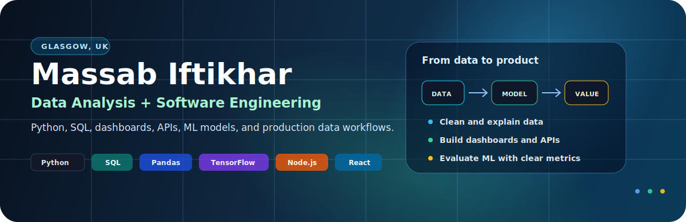

  

  <a href="mailto:massabiftkhar@gmail.com">Email</a> |
  <a href="https://github.com/HaXer420">GitHub</a> |
  <a href="https://linkedin.com/in/massab-jutt">LinkedIn</a> |
  <a href="https://www.massab.dev">Portfolio</a>

I work across **data analysis, software engineering, and machine learning**, with a focus on turning structured and time-series data into useful analysis, dashboards, APIs, and documented projects.

I recently completed an **MSc in Big Data Technologies with Distinction** at Glasgow Caledonian University. My dissertation analysed multimodal sensor data for fall detection using Python, Pandas, Scikit-learn, TensorFlow, and model evaluation metrics.

## What I Can Help With

- Analyse structured, operational, and time-series datasets using Python and SQL.
- Clean, transform, and prepare data for reporting, dashboards, and modelling.
- Build backend APIs, dashboards, and production data workflows.
- Compare machine learning models with clear metrics and limitations.
- Turn notebooks and technical work into readable GitHub portfolio projects.
- Connect data analysis with real software systems.

## What I Build

I build practical data-driven systems: tools that help people monitor activity, understand patterns, and make better decisions from messy or operational data.

My work often starts with raw data, an unclear workflow, or a real product requirement, and ends as something usable: a notebook, dashboard, API, model comparison, report, or documented repository.

| Signal | What it means in practice |
| --- | --- |
| Data analysis | Python, Pandas, NumPy, SQL, Excel, cleaning, descriptive analysis |
| Time-series work | Sensor data, window-based features, event monitoring, activity patterns |
| Machine learning | Scikit-learn, TensorFlow/Keras, Random Forest, SVM, BiLSTM, evaluation |
| Software engineering | Node.js, NestJS, React, REST APIs, PostgreSQL, MongoDB, AWS |
| Technical communication | README files, dashboards, reports, documentation, practical explanations |

## Featured Projects

<table>
<tr>
<td width="50%">

<strong>Multimodal Fall Detection Analytics</strong>

MSc dissertation project using the UP-Fall Detection Dataset to classify fall and non-fall activity from multimodal sensor readings.

`Python` `Pandas` `Scikit-learn` `TensorFlow` `BiLSTM` `SVM` `Random Forest`

[Open repository](YOUR_REPO_LINK_HERE)

</td>
<td width="50%">

<strong>Production Data Workflows</strong>

Backend and dashboard systems involving PostgreSQL, MongoDB, background jobs, real-time alerts, and AWS deployment.

`Node.js` `NestJS` `React` `PostgreSQL` `MongoDB` `AWS`

[Portfolio](https://www.massab.dev)

</td>
</tr>

<tr>
<td width="50%">

<strong>Geofencing Alert System</strong>

Location-based monitoring workflow processing 1,000+ location checks per day and triggering real-time notifications.

`Backend` `Dashboards` `Monitoring` `WebSockets` `Notifications`

Private professional work

</td>
<td width="50%">

<strong>PostgreSQL Workflow Optimisation</strong>

Worked on data-heavy PostgreSQL workflows across 300+ schemas and 50+ table interactions, improving processing delays through query and transaction tuning.

`PostgreSQL` `SQL` `Performance` `Data Workflows`

Private professional work

</td>
</tr>
</table>

## Build Stack

<table>
<tr>
<td width="50%">

<strong>Data Analysis</strong>

Python, Pandas, NumPy, SQL, Excel, data cleaning, feature extraction, descriptive statistics.

</td>
<td width="50%">

<strong>Machine Learning</strong>

Scikit-learn, TensorFlow, Keras, Random Forest, SVM, BiLSTM, precision, recall, F1, AUC.

</td>
</tr>

<tr>
<td width="50%">

<strong>Software Engineering</strong>

JavaScript, TypeScript, Node.js, NestJS, React, Next.js, REST APIs, WebSockets.

</td>
<td width="50%">

<strong>Databases and Cloud</strong>

PostgreSQL, MySQL, MongoDB, Redis, AWS EC2, S3, Docker, Git, CI/CD.

</td>
</tr>

<tr>
<td width="50%">

<strong>Product Surfaces</strong>

Dashboards, APIs, documentation, Swagger/OpenAPI, reporting workflows.

</td>
<td width="50%">

<strong>Quality Practices</strong>

Testing, documentation, reproducible workflows, code review, performance debugging.

</td>
</tr>
</table>

## Operating Style

I like work where data connects to a real question:

- Is this pattern normal or unusual?
- What does this metric mean for the user or customer?
- Which model performs better, and where does it fail?
- Can this workflow be made clearer, faster, or more reliable?
- How can technical results be explained simply?

The common thread is practical data work backed by software engineering.

## Current Direction

I am currently focused on:

- Data analyst and data science roles.
- Time-series, IoT, operational, and monitoring data.
- Sustainability, healthcare, building performance, and real-world analytics.
- Building a stronger public portfolio of Python, SQL, dashboard, and ML projects.
- Combining software engineering experience with analytical decision support.

## Contact

**Email:** massabiftkhar@gmail.com  
**GitHub:** www.github.com/HaXer420  
**LinkedIn:** www.linkedin.com/in/massab-jutt  
**Portfolio:** www.massab.dev

<!---
HaXer420/HaXer420 is a ✨ special ✨ repository because its `README.md` (this file) appears on your GitHub profile.
You can click the Preview link to take a look at your changes.
--->
